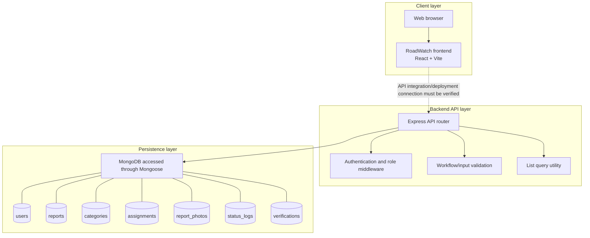

# RoadWatch System Architecture

> Audit status: based on the repository documentation and the inspected backend route/model code. Confirm the application entry points, database connection configuration, and deployed topology before treating this as a deployment diagram.

## Component diagram

## Components and responsibilities

- **Frontend:** The project README identifies a React 19 / Vite interface for citizens, field inspectors, and administrators. The current frontend-to-backend runtime connection was not established by the route files reviewed here; verify the frontend API service and environment configuration.
- **Express API:** `backend/src/routes/api.js` defines authentication, users, categories, reports, report status, report logs, verification, photos, and assignments endpoints.
- **Authentication and authorization:** Protected endpoints use `requireAuth`; role-restricted endpoints use `requireRole`. Login returns a bearer token with an eight-hour expiry.
- **Validation and workflow rules:** `backend/src/validators/workflow.js` validates user registration, report input, assignments, priorities, and role-specific status transitions.
- **Persistence:** `backend/src/models/index.js` maps Mongoose models to seven named collections. The schemas are flexible (`strict: false`); this diagram does not imply schema-enforced foreign keys.
- **Audit records:** Status changes create `status_logs`; inspection decisions upsert `verifications`; assignments track repair assignment and completion.

## Trust and integration notes

1. Protected API requests require a bearer token.
2. Citizens are limited to their own reports for report listing/detail and related log, verification, and photo endpoints.
3. The API uses Mongoose models, but this file does not verify the database connection string, deployment topology, or production configuration.
4. Do not label the frontend as definitely connected to this API until `frontend/src/services/api.js` and runtime configuration have been checked.
5. Do not treat this as a network/deployment diagram; servers, hosting, TLS, reverse proxies, and network boundaries have not been verified.
