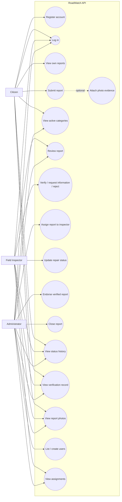

# RoadWatch Use-Case Diagram

> Scope: use cases supported by the inspected API routes and workflow validator. UI-only behavior and deployment details are outside this diagram.

## Actor notes

- **Citizen:** can self-register, sign in, view active categories, create reports, and access only their own report details and related records.
- **Field Inspector:** can perform the inspection decisions permitted by the transition rules, view assignments assigned to their email, and move an assigned verified report to `Ongoing`.
- **Administrator:** can list/create users, create assignments, endorse verified reports to the Engineering Office, and close reports through permitted transitions.
- All three roles can authenticate. Most other API routes require authentication; specific role requirements apply as implemented in `api.js`.

## Boundaries

This diagram represents API capabilities, not proof that every frontend screen currently calls the API. Account editing/deletion and report editing/deletion endpoints were not found in the inspected API router.
