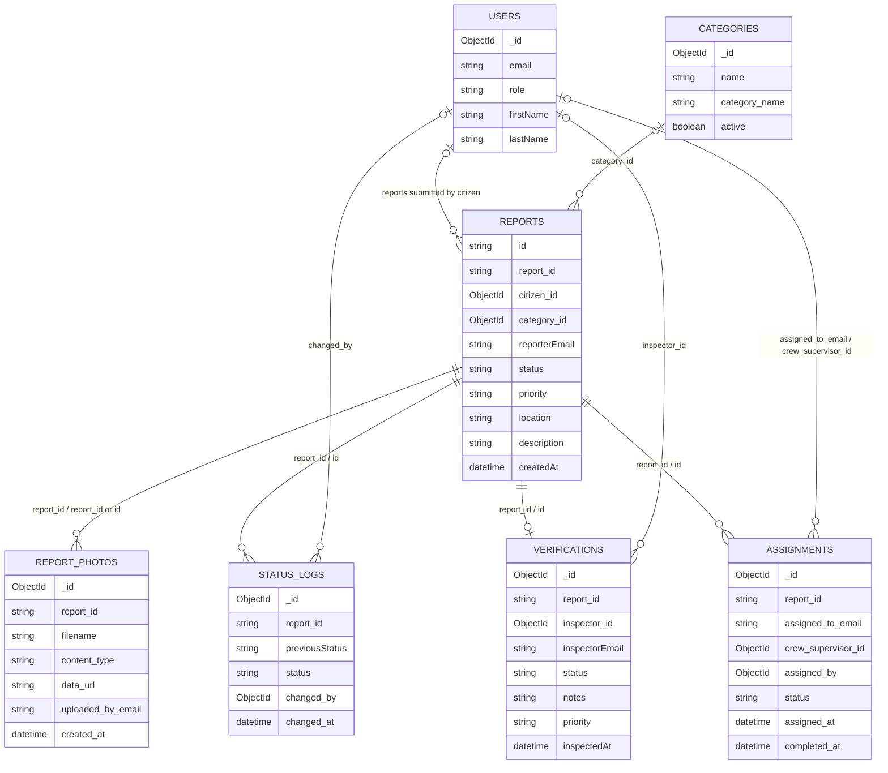

# RoadWatch Data Model (ERD)

> This is a logical, application-level ERD inferred from the inspected route code and collection mappings. The Mongoose schemas are flexible (`strict: false`), so the diagram shows observed references rather than enforced foreign keys. Field names vary between camelCase and snake_case in the current code.

## Observed relationships and caveats

- Report creation writes `citizen_id` from the user document and `category_id` from the category document. Reports also store reporter email/name and category text.
- Related photo, status log, verification, and assignment documents use a report identifier, typically `report_id`; report lookups accept `id`, `reportId`, or `report_id`.
- The API upserts one verification record per report using `report_id`; the diagram therefore shows a zero-or-one verification relationship as intended by that operation.
- Assignment creation upserts by `report_id`, so the current route maintains one assignment document per report rather than a full assignment history.
- Some relationships are by email, while others use MongoDB ObjectIds. These are logical references, not database-enforced foreign keys.
- Exact fields and indexes must be confirmed against real stored documents and database indexes before treating this as a definitive physical ERD.
