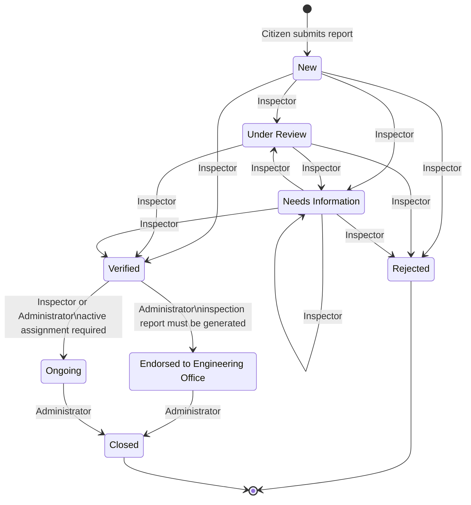

# Report Status Workflow

> Source of truth for allowed transitions: `backend/src/validators/workflow.js`. The route handler in `backend/src/routes/api.js` applies these rules and adds additional checks for assignments and endorsement.

## Transition rules

| Current status | Next status | Role | Additional conditions |
|---|---|---|---|
| New | Under Review | Field Inspector | Allowed by transition validator |
| New | Verified | Field Inspector | Inspection notes and valid priority required |
| New | Needs Information | Field Inspector | Inspection notes and valid priority required |
| New | Rejected | Field Inspector | Inspection notes and valid priority required |
| Under Review | Verified | Field Inspector | Inspection notes and valid priority required |
| Under Review | Needs Information | Field Inspector | Inspection notes and valid priority required |
| Under Review | Rejected | Field Inspector | Inspection notes and valid priority required |
| Needs Information | Under Review | Field Inspector | Allowed by transition validator |
| Needs Information | Verified | Field Inspector | Inspection notes and valid priority required |
| Needs Information | Needs Information | Field Inspector | Inspection notes and valid priority required |
| Needs Information | Rejected | Field Inspector | Inspection notes and valid priority required |
| Verified | Ongoing | Field Inspector | Active assignment required; inspector must be assigned inspector |
| Verified | Ongoing | Administrator | Active assignment required |
| Verified | Endorsed to Engineering Office | Administrator | `reportGeneratedAt` must be a parseable date; optional endorsement reference is limited to 200 characters |
| Endorsed to Engineering Office | Closed | Administrator | Completion notes optional, max 2,000 characters |
| Ongoing | Closed | Administrator | Completion notes optional, max 2,000 characters |

## Audit side effects

- New report creation writes a `reports` document and a `status_logs` record for the initial `New` status.
- Inspection decisions (`Verified`, `Needs Information`, `Rejected`) require inspector notes (max 2,000 characters) and a priority of `Low`, `Medium`, or `High`; a `verifications` record is upserted.
- Every successful status transition creates a `status_logs` record with the previous status, new status, actor, timestamp, and details.
- Endorsement records the Engineering Office as recipient, endorsement time, actor, and optional reference.
- Closing records the closure time and actor, and changes any active assignment for that report to `Completed`.

## Explicitly not allowed by the validator

- Field Inspector cannot close a report directly.
- Administrator cannot directly move `Verified` to `Ongoing` unless an active assignment exists; the transition validator allows the admin transition only for endorsement, so an Admin `Verified → Ongoing` request is rejected by the current `canTransition` rules.
- `Verified → Closed` is not an allowed direct transition.
- No transition is defined out of `Rejected` or `Closed`.

> Note: The route has a general `Ongoing` assignment check, but the transition validator is decisive first. Because `Administrator` does not have a `Verified → Ongoing` transition in the validator, the practical permitted path to `Ongoing` is the Field Inspector transition with an active assignment.
